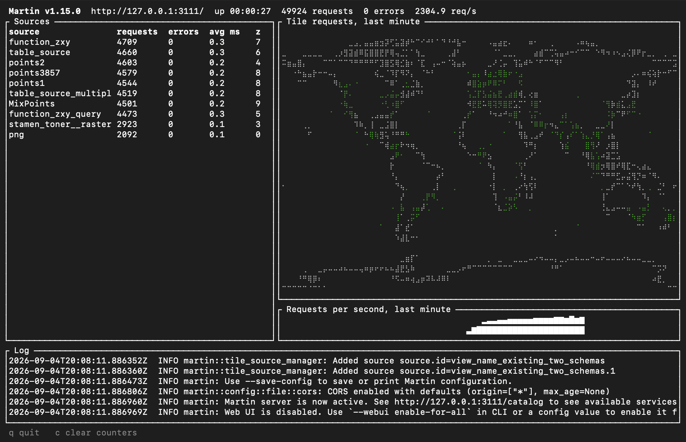

Martin is a tile server optimized for speed and heavy traffic, written in [Rust](https://github.com/rust-lang/rust).

- :material-clock-fast:{ .lg .middle } __Quick Start__

    ---

    [Install](installation.md) a binary, a Docker image, or a package, and serve your first tiles within a few minutes.

    [:octicons-arrow-right-24: Get started](quick-start/index.md)

-   :material-layers-triple:{ .lg .middle } __Tile sources__

    ---

    [PostGIS](pg-connections/index.md) tables and functions with automatic discovery, [PMTiles](sources-pmtiles.md), [MBTiles](sources-mbtiles.md), [COG](sources-cog-files.md), [GeoJSON](sources-geojson.md), and [GeoParquet](sources-duckdb.md), [combined](sources-composite.md) into one source where you need it.

    [:octicons-arrow-right-24: Configure sources](sources-tiles/index.md)

-   :material-palette:{ .lg .middle } __Styles, sprites & fonts__

    ---

    Serve [styles](sources-styles/index.md) and generate [sprites](sources-sprites.md) and [font glyphs](sources-fonts.md) on the fly, so a map needs nothing but Martin.

    [:octicons-arrow-right-24: Supporting resources](sources-styles/index.md)

-   :material-package-variant-closed:{ .lg .middle } __Bulk generation & tooling__

    ---

    Generate tiles into an archive with [martin-cp](martin-cp.md), then examine, copy, validate, and diff it with [mbtiles](mbtiles/index.md).

    [:octicons-arrow-right-24: Provided tools](tools.md)

- :material-console:{ .lg .middle } __Run it anywhere__

    ---

    A single binary on a server, in [Docker](run-with-docker.md), on [AWS Lambda](run-with-lambda.md), or behind [NGINX](run-with-nginx.md) and [Apache](run-with-apache.md).

    [:octicons-arrow-right-24: Running Martin](run/index.md)

-   

    :material-monitor-dashboard:{ .lg .middle } __Terminal & web UI__

    ---

    Useful for monitoring, debugging and development.

    [:octicons-arrow-right-24: Terminal dashboard](run-with-cli.md)

[Explore on our demo site](https://martin.maplibre.org/){ .md-button .md-button--primary }
[Use it with your map](using-guides/index.md){ .md-button }
[API endpoints](using.md){ .md-button }
