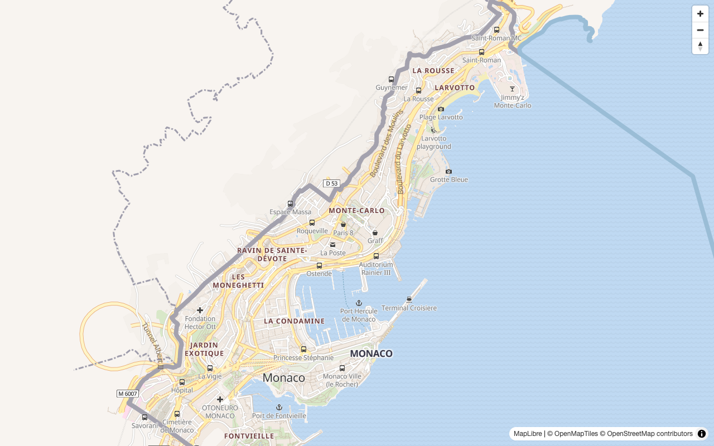

# Building a Self-hosted Basemap from Scratch

This guide takes you from nothing to a fully styled vector basemap in your browser, with every part of the stack served from your own machine.
At the end, a single Martin instance serves the tiles, the glyphs, the sprites, and the style itself.
No API keys and no external services are needed.

A rendered basemap needs four things:

- a **tile archive** containing the map data,
- a **style** telling the renderer how to draw that data,
- the **glyphs** (fonts) the style labels text with, and
- the **sprites** (icons) the style marks points of interest with.

We will produce each one, then wire them together.

## Prerequisites

We expect you have the following already installed:

- [Docker](https://docker.io) to generate the tile archive
- [Martin binary](installation.md)
- `git` and `curl` to fetch the style and fonts

All commands below run from one working directory.

## Generate a tile archive from OpenStreetMap

We will use [Planetiler](https://github.com/onthegomap/planetiler/) to build an MBTiles archive of Monaco from [OpenStreetMap](https://osm.org) data.
Planetiler downloads the OSM extract for you and tiles it into the [OpenMapTiles](https://openmaptiles.org/) schema.
See [Setting up a Basemap and Overlaying Points from PostGIS](recipe-basemap-postgis.md) for a discussion of why a tiling step is needed and what OpenMapTiles is, and [our tile source comparison](sources-tiles/index.md) for the pros and cons of the different archive formats.

```bash
mkdir --parents data
docker run \
  --user=$UID \
  -e JAVA_TOOL_OPTIONS="-Xmx1g" \
  -v "$(pwd)/data":/data \
  --rm \
  ghcr.io/onthegomap/planetiler:latest \
  --download \
  --minzoom=0 \
  --maxzoom=14 \
  --tile_compression=none \
  --area=monaco \
  --output /data/monaco.mbtiles
```

Monaco is small, so this finishes in a few minutes.
Any other [Geofabrik extract name](https://download.geofabrik.de/) works as `--area` the same way, with larger downloads and longer runs.

## Get a style

A style only works with data in the schema it was written for.
Planetiler produced tiles in the OpenMapTiles schema, so we need an OpenMapTiles style.
We will use [OSM Bright](https://github.com/openmaptiles/osm-bright-gl-style).
[Positron](https://github.com/openmaptiles/positron-gl-style), [Dark Matter](https://github.com/openmaptiles/dark-matter-gl-style), [MapTiler Basic](https://github.com/openmaptiles/maptiler-basic-gl-style), and [OSM Liberty](https://github.com/maputnik/osm-liberty) are alternatives.

```bash
git clone --depth 1 https://github.com/openmaptiles/osm-bright-gl-style.git
mkdir --parents styles
cp osm-bright-gl-style/style.json styles/basemap.json
```

!!! note "Attribution"

    Your map must display [`© OpenMapTiles`](https://openmaptiles.org/) and [`© OpenStreetMap contributors`](https://www.openstreetmap.org/copyright).
    The tile archive built above carries this attribution in its metadata, and MapLibre displays it automatically.

## Get the fonts the style uses

OSM Bright labels text with `Noto Sans Regular`, `Noto Sans Bold`, and `Noto Sans Italic`.
Martin generates the glyph ranges MapLibre asks for [directly from `.ttf`/`.otf` files](sources-fonts.md), so all we need are the font files themselves:

```bash
mkdir --parents fonts
curl -L -o fonts/NotoSans-Regular.ttf https://github.com/notofonts/notofonts.github.io/raw/main/fonts/NotoSans/full/ttf/NotoSans-Regular.ttf
curl -L -o fonts/NotoSans-Bold.ttf https://github.com/notofonts/notofonts.github.io/raw/main/fonts/NotoSans/full/ttf/NotoSans-Bold.ttf
curl -L -o fonts/NotoSans-Italic.ttf https://github.com/notofonts/notofonts.github.io/raw/main/fonts/NotoSans/full/ttf/NotoSans-Italic.ttf
```

Martin publishes each font under the name embedded in the file.
Here that is `Noto Sans Regular`, `Noto Sans Bold`, and `Noto Sans Italic`, exactly the names the style asks for.

## Get the icons the style uses

The style repository ships its icons as SVG files.
Martin [generates the spritesheet and index from an SVG directory on the fly](sources-sprites.md), so copying the folder is all that is needed:

```bash
cp -r osm-bright-gl-style/icons icons
```

The directory name becomes the sprite ID, so these will be served under `/sprite/icons`.

## Point the style at your server

The copied style still references the original author's tile, glyph, and sprite servers.
Open `styles/basemap.json` and change three values to point at the Martin instance we are about to start:

| Key                          | New value                                        |
|------------------------------|--------------------------------------------------|
| `sources.openmaptiles.url`   | `http://localhost:3000/monaco`                   |
| `glyphs`                     | `http://localhost:3000/font/{fontstack}/{range}` |
| `sprite`                     | `http://localhost:3000/sprite/icons`             |

The `sources` URL is the [TileJSON endpoint](using.md) of the `monaco` archive.
The `{fontstack}` and `{range}` placeholders are filled in by MapLibre when it requests glyph ranges.

## Run Martin

Everything is in place, so serve all four resources with one command:

```bash
martin data/monaco.mbtiles --font fonts --sprite icons --style styles
```

Check <http://localhost:3000/catalog> to see the `monaco` tile source, the three fonts, the `icons` sprite, and the `basemap` style.
For more control over what is published and how, see the [configuration file](config-file/index.md) documentation.
`--save-config` converts the command line above into a config file to grow from.

## View the map

Save this as `index.html` in the working directory and open it in your browser:

```html
<!DOCTYPE html>
<html>
<head>
  <meta charset="utf-8">
  <title>My self-hosted map</title>
  <script src="https://unpkg.com/maplibre-gl@^5/dist/maplibre-gl.js"></script>
  <link rel="stylesheet" href="https://unpkg.com/maplibre-gl@^5/dist/maplibre-gl.css">
  <style>
    html, body, #map { height: 100%; margin: 0; }
  </style>
</head>
<body>
  <div id="map"></div>
  <script>
    const map = new maplibregl.Map({
      container: 'map',
      style: 'http://localhost:3000/style/basemap',
      center: [7.4266, 43.7396],
      zoom: 14,
    });
    map.addControl(new maplibregl.NavigationControl());
  </script>
</body>
</html>
```



The page loads the style from Martin, and the style pulls the tiles, glyphs, and sprites from Martin.
The complete map is served from your machine.

!!! note

    Small extracts may not contain every layer the style references.
    Monaco has no aerodrome, so the browser console warns that the `aerodrome_label` source layer does not exist.
    The map renders fine regardless.

## Where to go from here

- [Overlay your own data from PostGIS on this basemap](recipe-basemap-postgis.md)
- Put Martin behind a [reverse proxy](run-with-reverse-proxy/index.md) for TLS, caching, and a public hostname, and update the three URLs in the style to the public one
- Pre-generate tiles for offline use or for seeding a cache with [`martin-cp`](martin-cp.md)
- [Render the style into raster tiles server-side](sources-styles/rendering.md)
