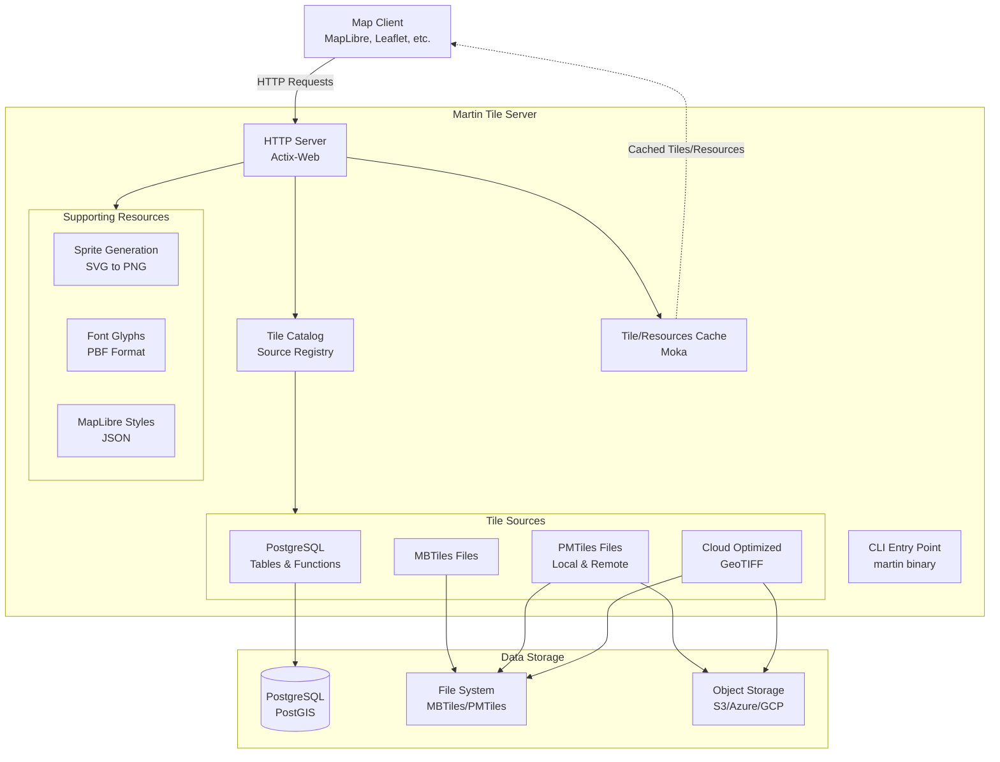

# Architecture

This document provides a high-level overview of Martin's architecture, describing its major components, how they interact, and the rationale behind key design decisions.

## Overview

Martin is a blazing fast tile server written in Rust that generates and serves vector tiles on the fly from multiple data sources. It is designed to handle heavy traffic and optimize for speed while maintaining a clean separation of concerns.



## Core Components

Martin's architecture is organized into four main Rust crates, each with distinct responsibilities:

=== "martin (Martin Server)"

    **Purpose**: The main tile server binary and HTTP service layer.

    **Location**: `/martin`

    **Key Responsibilities**:

    - HTTP server using Actix-Web framework
    - Request routing and endpoint handling
    - Configuration parsing (CLI args, env vars, config files)
    - Tile source discovery and initialization
    - Serving the Web UI for tile inspection

    **Main Modules**:

    - `src/bin/martin.rs` - Server entry point
    - `src/bin/martin-cp.rs` - Bulk tile copying tool
    - `src/srv/` - HTTP service handlers
    - `server.rs` - Main server setup and routing
    - `tiles/` - Tile serving endpoints
    - `fonts.rs` - Font glyph serving
    - `sprites.rs` - Sprite serving
    - `styles.rs` - Style serving
    - `src/config/` - Configuration management
    - `args/` - CLI argument parsing
    - `file/` - Config file parsing
    - `martin-ui/` - React-based web interface

=== "martin-core (Library)"

    **Purpose**: Core abstractions and implementations for tile sources and supporting resources.

    **Location**: `/martin-core`

    **Key Responsibilities**:

    - Abstract tile source traits and implementations
    - PostgreSQL connection pooling and query execution
    - MBTiles and PMTiles reading
    - Cloud Optimized GeoTIFF (COG) tile extraction
    - Sprite, font, and style resource generation
    - Tile format handling (MVT protocol buffers)

    **Main Modules**:

    - `src/tiles/` - Tile source implementations
    - `postgres/` - PostGIS table and function sources
    - `mbtiles/` - MBTiles file source
    - `pmtiles/` - PMTiles file source
    - `cog/` - Cloud Optimized GeoTIFF source
    - `catalog.rs` - Source registry and management
    - `src/resources/` - Supporting resources
    - `sprites/` - SVG sprite generation
    - `fonts/` - Font glyph generation
    - `styles/` - MapLibre style handling

=== "mbtiles (Library and CLI)"

    **Purpose**: MBTiles format support and manipulation tools.

    **Location**: `/mbtiles`

    **Key Responsibilities**:

    - SQLite-based MBTiles reading and writing
    - Metadata management
    - Tile compression (gzip, brotli)
    - Validation and integrity checking
    - Diff/patch operations between MBTiles files
    - Schema management

    **Main Modules**:

    - `src/lib.rs` - Core MBTiles library
    - `src/bin/mbtiles.rs` - CLI tool
    - `sql/` - SQL schema and migrations

=== "martin-tile-utils"

    **Purpose**: Low-level tile manipulation and conversion utilities.

    **Location**: `/martin-tile-utils`

    **Key Responsibilities**:

    - Tile coordinate system conversions
    - Tile encoding/decoding
    - Tile format utilities
    - Bounding box calculations

## Data Flow

=== "Tile Request Flows"

    ```mermaid
    sequenceDiagram
        participant Client
        participant Server as HTTP Server
        participant Catalog
        participant Cache
        participant Source as Tile Source
        participant DB as Data Store

        Client->>Server: GET /source_id/z/x/y
        Server->>Catalog: Resolve source_id
        Catalog-->>Server: Source reference
        Server->>Cache: Check cache

        alt Tile in cache
            Cache-->>Server: Cached tile
            Server-->>Client: 200 OK (tile data)
        else Tile not in cache
            Server->>Source: Get tile(z, x, y)
            Source->>DB: Query data
            DB-->>Source: Raw data
            Source->>Source: Generate MVT
            Source-->>Server: Tile data
            Server->>Cache: Store tile
            Server-->>Client: 200 OK (tile data)
        end
    ```

=== "Configuration and Initialization Flow"

    ```mermaid
    sequenceDiagram
        participant CLI
        participant Config as Config Parser
        participant Discovery as Source Discovery
        participant Sources as Tile Sources
        participant Server as HTTP Server

        CLI->>Config: Parse args & config file
        Config->>Discovery: Initialize sources

        alt PostgreSQL Source
            Discovery->>Discovery: Connect to database
            Discovery->>Discovery: Query tables & functions
            Discovery->>Sources: Register table sources
            Discovery->>Sources: Register function sources
        end

        alt File Sources
            Discovery->>Discovery: Scan MBTiles files
            Discovery->>Discovery: Scan PMTiles files
            Discovery->>Sources: Register file sources
        end

        Sources-->>Server: Source catalog
        Server->>Server: Setup routes
        Server->>Server: Start HTTP listener
    ```

=== "Resource Generation Flow"

    ```mermaid
    sequenceDiagram
        participant Client
        participant Server
        participant Sprite as Sprite Generator
        participant Font as Font Generator
        participant FS as File System

        Client->>Server: GET /sprite/sprite_id
        Server->>Sprite: Generate sprite
        Sprite->>FS: Read SVG files
        FS-->>Sprite: SVG data
        Sprite->>Sprite: Render to PNG
        Sprite->>Sprite: Generate JSON index
        Sprite-->>Server: Sprite sheet
        Server-->>Client: PNG/JSON response

        Client->>Server: GET /font/fontstack/range
        Server->>Font: Generate glyphs
        Font->>FS: Read font files
        FS-->>Font: Font data
        Font->>Font: Rasterize glyphs
        Font->>Font: Encode as PBF
        Font-->>Server: Glyph data
        Server-->>Client: PBF response
    ```

## Key Design Decisions

!!! note
    > 🧠 This section provides **background and context**, not required knowledge.
    > You don’t need to understand or remember all of this to use or contribute to Martin.
    > Read it when you’re curious *why* certain choices were made.

### Rust for Performance and Safety

??? "<b>Why Rust</b>: Martin is written in Rust to balance high performance with strong safety guarantees.<i>(click to expand)</i>"
    - Near-C performance without manual memory management
    - Memory safety (no null pointers or buffer overflows)
    - Safe concurrency without data races
    - Zero-cost abstractions that compile to efficient code

</details>

### Actix-Web Framework

??? "<b>Why Actix-Web</b>: It offers a fast, production-ready async HTTP stack.<i>(click to expand)</i>"
    - High-performance async request handling
    - Mature middleware ecosystem
    - Built-in compression and caching headers
    - Easy Prometheus metrics integration

### Async/Await Throughout

??? "<b>Why async/await</b>: Allows Martin to handle many concurrent requests efficiently.<i>(click to expand)</i>"
    - Handles thousands of concurrent connections
    - Avoids blocking database queries
    - Enables efficient file and network I/O
    - Keeps thread usage low under load

### Crate Separation

??? "<b>Why multiple crates</b>: The codebase is split into crates with clear responsibilities.<i>(click to expand)</i>"
    - **martin-core** — reusable core logic and tile sources
    - **mbtiles** — standalone MBTiles tooling
    - **martin** — HTTP server, configuration, and runtime wiring
    - **martin-tile-utils** — shared low-level tile utilities

    This makes it easier to:

    - Embed Martin as a library in other Rust projects
    - Use MBTiles tools independently
    - Maintain clear API boundaries and versioning

### PostgreSQL Connection Pooling

??? "<b>Why connection pooling</b>: Reuse database connections instead of reconnecting per request.<i>(click to expand)</i>"

    - Uses `deadpool-postgres`
    - Avoids per-request connection overhead
    - Configurable pool sizing
    - Automatic connection health checks

### In-Memory Tile Caching

??? "<b>Why caching</b>: Avoid regenerating frequently requested tiles.<i>(click to expand)</i>"

    - Fast LRU cache with optional TTLs
    - Automatic eviction of least-used entries
    - Configurable memory limits (default: 512 MB)
    - Thread-safe concurrent access
    - Significant performance improvements for repeated requests

### Automatic Source Discovery

??? "<b>Why auto-discovery</b>: Martin tries to work out of the box with minimal configuration.<i>(click to expand)</i>"

    It can currently automatically detect:

    - PostgreSQL tables with geometry columns
    - PostgreSQL functions that return MVT
    - MBTiles and PMTiles files in configured directories

    This keeps common setups close to zero-config.

### Multi-Protocol Tile Support

**Why multiple formats**: Different workloads benefit from different storage models. This lets operators pick the best format for their use case:

=== "PostgreSQL"
    Dynamic tiles generated from live data. Best for frequently changing datasets.

=== "MBTiles"
    Pre-generated tile archives. Simple and fast for static datasets.

=== "PMTiles"
    Single-file, cloud-native archives optimized for HTTP range requests.

=== "COG"
    Direct tile serving from Cloud Optimized GeoTIFFs.

### On-the-Fly Resource Generation

??? "<b>Why generate resources dynamically</b>: Sprites, fonts, and styles are created on demand.<i>(click to expand)</i>"

    - No pre-processing step required
    - Simpler deployments (just provide source files)
    - URL-based customization
    - Less storage overhead

### Modular Configuration

??? "<b>Why layered configuration</b>: Martin supports multiple configuration sources.<i>(click to expand)</i>"

    - CLI flags for quick testing and overrides
    - Environment variables for containerized deployments
    - Config files for larger or more complex setups
    - Clear precedence between configuration layers

## Component Interactions

=== "PosgtgreSQL Integration"

    ```mermaid
    graph TB
        Martin[Martin Server]
        Pool[Connection Pool<br/>deadpool-postgres]

        subgraph PostgreSQL
            Tables[Tables with<br/>Geometry Columns]
            Functions[MVT Functions]
            PostGIS[PostGIS Extension]
        end

        Martin --> Pool
        Pool --> Tables
        Pool --> Functions
        Tables --> PostGIS
        Functions --> PostGIS
    ```

    **How it works**:

    1. Martin connects to PostgreSQL using connection string
    2. Queries `geometry_columns` view to discover tables
    3. Queries `pg_proc` to discover MVT-returning functions
    4. Maintains connection pool for efficient query execution
    5. Generates tile SQL queries with bbox parameters
    6. Returns results as MVT tiles

=== "File Source Integration"

    ```mermaid
    graph TB
        Martin[Martin Server]

        subgraph "Local Files"
            MBT[MBTiles<br/>SQLite]
            PMT[PMTiles<br/>Binary Format]
            COG[GeoTIFF<br/>Cloud Optimized]
        end

        subgraph "Remote Files"
            S3MBT[S3/Azure/GCP<br/>MBTiles]
            S3PMT[S3/Azure/GCP<br/>PMTiles]
            S3COG[S3/Azure/GCP<br/>GeoTIFF]
        end

        Martin --> MBT
        Martin --> PMT
        Martin --> COG
        Martin --> S3MBT
        Martin --> S3PMT
        Martin --> S3COG
    ```

    **How it works**:

    1. Martin scans configured directories for tile files
    2. Opens MBTiles with SQLite (using `sqlx`)
    3. Opens PMTiles with custom parser (HTTP range requests for remote)
    4. Opens COG with TIFF parser (HTTP range requests for remote)
    5. Uses `object_store` crate for S3/Azure/GCP access
    6. Serves tiles directly from file format

## Deployment Patterns

Martin supports multiple deployment patterns:

=== "Standalone Server"

    - Single binary with embedded WebUI
    - Direct PostgreSQL connection
    - Local file serving
    - Suitable for small to medium deployments

=== "Container Deployment"

    - Docker image with all dependencies
    - Configuration via environment variables
    - Health check endpoints
    - Suitable for Kubernetes and container orchestrators

=== "Serverless (AWS Lambda)"

    - Lambda adapter for Actix-Web
    - Cold start optimization
    - Stateless operation
    - Suitable for sporadic traffic

=== "Behind Reverse Proxy"

    - NGINX or Apache fronting Martin
    - Additional caching layer
    - SSL termination
    - Load balancing across multiple Martin instances

## Performance Characteristics

=== "PostgreSQL Queries"

    - **Bottleneck**: Complex geometry queries on large tables
    - **Optimization**: Spatial indexes (GIST), connection pooling, query tuning

=== "Tile Encoding"

    - **Bottleneck**: MVT encoding CPU time
    - **Optimization**: Tile caching, pre-generated MBTiles for static data

=== "Network (I/O)"

    - **Bottleneck**: High tile request rate
    - **Optimization**: Async I/O, connection keep-alive, compression

=== "Memory"

    - **Bottleneck**: Large tile cache size
    - **Optimization**: LRU eviction, configurable cache size, streaming responses

<!-- New Tab Group -->

=== "Vertical Scaling"

    - Increase CPU for faster tile generation
    - Increase memory for larger tile cache
    - Faster disk I/O for file sources

=== "Horizontal Scaling"

    - Run multiple Martin instances behind load balancer
    - Each instance maintains its own cache
    - Shared PostgreSQL database with connection pooling
    - CDN for tile distribution

<!-- New Tab Group -->

=== "Input Validation"

    - All tile coordinates validated (z/x/y bounds)
    - SQL injection prevention through parameterized queries
    - Path traversal prevention for file sources
    - URL parsing with strict validation

=== "Database Access"

    - Read-only database user recommended
    - Connection string security (avoid logging)
    - SSL/TLS support for PostgreSQL connections
    - Certificate validation for secure connections

=== "Network Security"

    - CORS configuration for cross-origin requests
    - Rate limiting (via reverse proxy)
    - Authentication/authorization (via reverse proxy)
    - HTTPS termination (via reverse proxy)

## Extensibility Points

### Adding New Tile Sources

To add a new tile source type:

1. Implement the `Source` trait in `martin-core`
2. Add configuration parsing in `martin`
3. Register source in the catalog
4. Add integration tests

Example source types that could be added:

- Direct GeoJSON file serving
- Vector tile rendering from raster data
- Integration with other spatial databases

### Adding New Resource Types

To add new resource endpoints:

1. Implement resource generator in `martin-core`
2. Add HTTP handler in `martin/src/srv/`
3. Add configuration support
4. Update catalog/discovery

### Custom Authentication/Authorization

Martin doesn't include built-in auth, but supports:

- Reverse proxy authentication (recommended)
- Custom Actix-Web middleware
- Token-based access control via proxy

## Monitoring and Observability

=== "Metrics"

    Martin exposes Prometheus metrics via `/_/metrics`:

    - HTTP request counters and histograms

    If you need more in-depth observability, we would be happy to review PRs that add additional metrics; the current implementation is intentionally minimal.

=== "Health Checks"

    We allow health checks via `/health` and `/catalog` endpoints:

    - `/health` - Basic health check (HTTP 200)
    - `/catalog` - Source availability check

=== "Logging"

    - logging via `env_logger`
    - Configurable log levels
    - Request/response logging

## Related Documentation

- [Development Guide](development.md) - Contributing to Martin
- [Configuration File](config-file.md) - Detailed configuration options
- [API Documentation](using.md) - HTTP API reference
- [Sources Documentation](sources-tiles.md) - Tile source configuration
