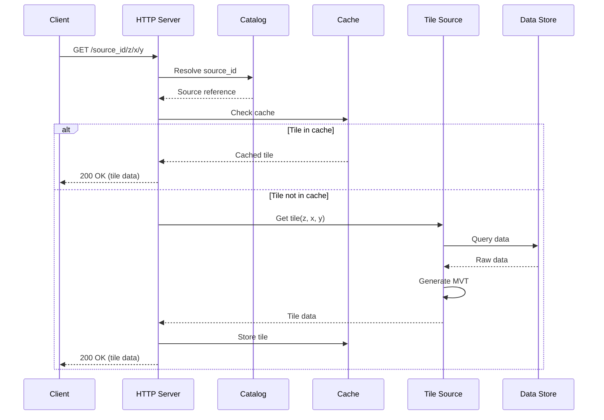
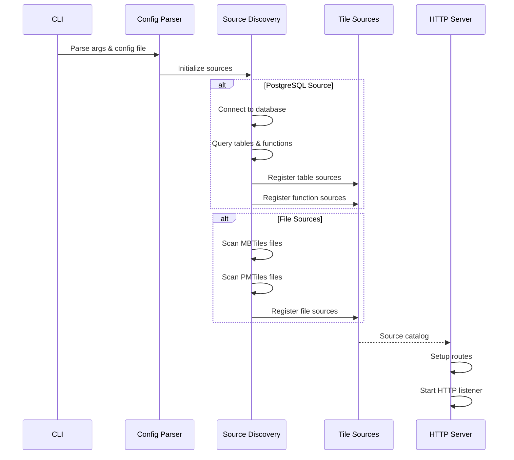
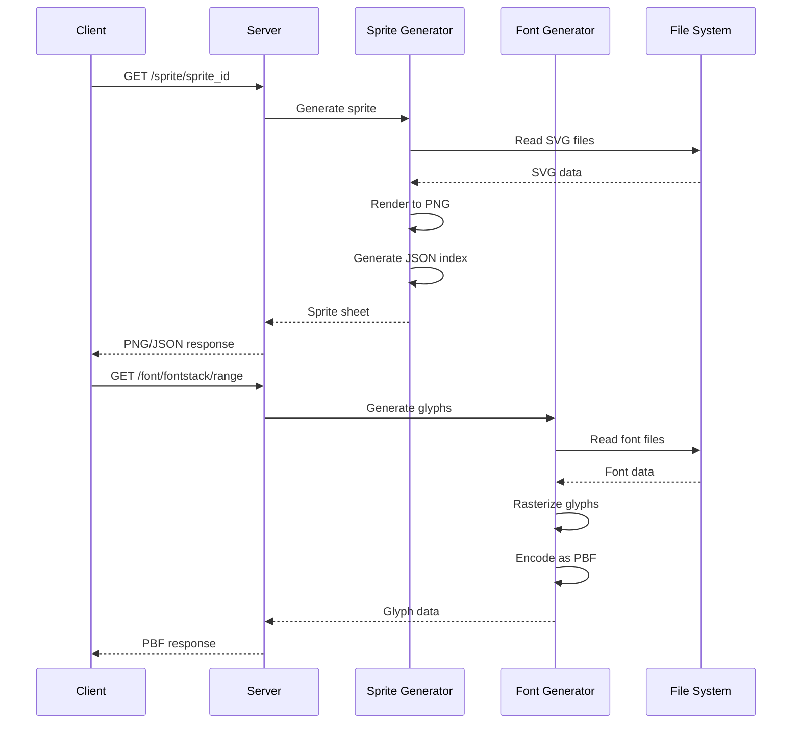
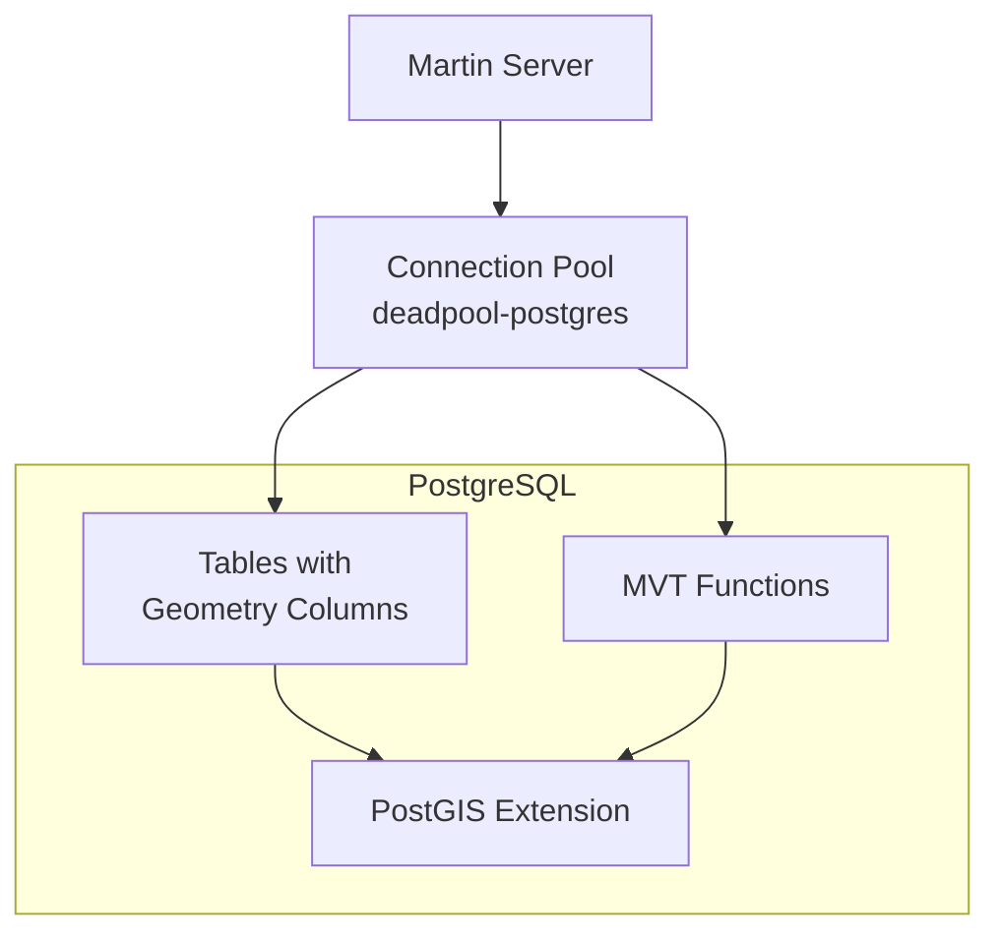
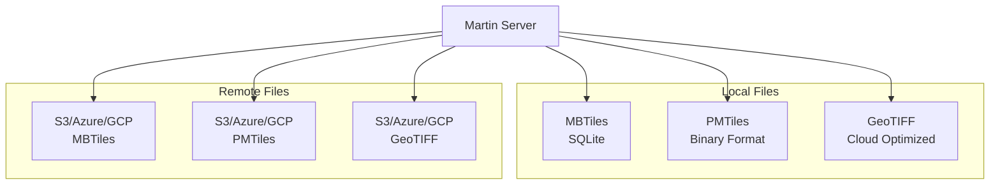

# Architecture

This document provides a high-level overview of Martin's architecture, describing its major components, how they interact, and the rationale behind key design decisions.

## Overview

Martin is a blazing fast tile server written in Rust that generates and serves vector tiles on the fly from multiple data sources. It is designed to handle heavy traffic and optimize for speed while maintaining a clean separation of concerns.

## Core Components

Martin's architecture is organized into four main Rust crates, each with distinct responsibilities:

### 1. martin (Main Server)

**Purpose**: The main tile server binary and HTTP service layer.

**Location**: `/martin`

**Key Responsibilities**:
- HTTP server using Actix-Web framework
- Request routing and endpoint handling
- Configuration parsing (CLI args, env vars, config files)
- Tile source discovery and initialization
- Serving the Web UI for tile inspection

**Main Modules**:
- `src/bin/martin.rs` - Server entry point
- `src/bin/martin-cp.rs` - Bulk tile copying tool
- `src/srv/` - HTTP service handlers
  - `server.rs` - Main server setup and routing
  - `tiles/` - Tile serving endpoints
  - `fonts.rs` - Font glyph serving
  - `sprites.rs` - Sprite serving
  - `styles.rs` - Style serving
- `src/config/` - Configuration management
  - `args/` - CLI argument parsing
  - `file/` - Config file parsing
- `martin-ui/` - React-based web interface

### 2. martin-core (Shared Library)

**Purpose**: Core abstractions and implementations for tile sources and supporting resources.

**Location**: `/martin-core`

**Key Responsibilities**:
- Abstract tile source traits and implementations
- PostgreSQL connection pooling and query execution
- MBTiles and PMTiles reading
- Cloud Optimized GeoTIFF (COG) tile extraction
- Sprite, font, and style resource generation
- Tile format handling (MVT protocol buffers)

**Main Modules**:
- `src/tiles/` - Tile source implementations
  - `postgres/` - PostGIS table and function sources
  - `mbtiles/` - MBTiles file source
  - `pmtiles/` - PMTiles file source
  - `cog/` - Cloud Optimized GeoTIFF source
  - `catalog.rs` - Source registry and management
- `src/resources/` - Supporting resources
  - `sprites/` - SVG sprite generation
  - `fonts/` - Font glyph generation
  - `styles/` - MapLibre style handling

### 3. mbtiles (MBTiles Library & CLI)

**Purpose**: MBTiles format support and manipulation tools.

**Location**: `/mbtiles`

**Key Responsibilities**:
- SQLite-based MBTiles reading and writing
- Metadata management
- Tile compression (gzip, brotli)
- Validation and integrity checking
- Diff/patch operations between MBTiles files
- Schema management

**Main Modules**:
- `src/lib.rs` - Core MBTiles library
- `src/bin/mbtiles.rs` - CLI tool
- `sql/` - SQL schema and migrations

### 4. martin-tile-utils (Tile Utilities)

**Purpose**: Low-level tile manipulation and conversion utilities.

**Location**: `/martin-tile-utils`

**Key Responsibilities**:
- Tile coordinate system conversions
- Tile encoding/decoding
- Tile format utilities
- Bounding box calculations

## Data Flow

### Tile Request Flow

### Configuration and Initialization Flow

### Resource Generation Flow

## Key Design Decisions

### 1. Rust for Performance and Safety

**Rationale**: Martin is written in Rust to achieve:
- **Performance**: Near-C performance for CPU-intensive tile generation
- **Memory Safety**: No null pointer dereferences or buffer overflows
- **Concurrency**: Safe concurrent access without data races
- **Zero-cost Abstractions**: High-level code with low-level performance

### 2. Actix-Web Framework

**Rationale**: Actix-Web provides:
- High-performance async HTTP server
- Mature middleware ecosystem
- Excellent streaming support for large tiles
- Built-in compression and caching headers
- Easy integration with Prometheus metrics

### 3. Async/Await Throughout

**Rationale**: Async I/O enables:
- Handling thousands of concurrent connections
- Non-blocking database queries
- Efficient file I/O operations
- Minimal thread overhead

### 4. Crate Separation

**Rationale**: Splitting into multiple crates provides:
- **martin-core**: Reusable as a library in other projects
- **mbtiles**: Standalone MBTiles tooling
- **martin**: Server-specific concerns (HTTP, config)
- **martin-tile-utils**: Shared low-level utilities

This enables:
- Using Martin as a library (embedding in other Rust projects)
- Using MBTiles tools independently
- Clear API boundaries and versioning

### 5. PostgreSQL Connection Pooling

**Rationale**: Using `deadpool-postgres`:
- Maintains a pool of persistent database connections
- Avoids connection overhead per request
- Configurable pool size for scaling
- Automatic connection health checking

### 6. In-Memory Tile Caching

**Rationale**: Using `moka` cache provides:
- Fast LRU cache with TTL support
- Automatic eviction of least-used tiles
- Configurable memory limits (default 512MB)
- Thread-safe concurrent access
- Significant performance improvement for repeated tile requests

### 7. Automatic Source Discovery

**Rationale**: Martin automatically discovers:
- PostgreSQL tables with geometry columns
- PostgreSQL functions returning MVT
- MBTiles/PMTiles files in directories

This reduces configuration burden and enables zero-config operation for common scenarios.

### 8. Multi-Protocol Tile Support

**Rationale**: Supporting multiple source types enables:
- **PostgreSQL**: Dynamic tiles from live data
- **MBTiles**: Pre-generated tile archives
- **PMTiles**: Cloud-native single-file archives
- **COG**: Direct serving from GeoTIFF files

This flexibility allows operators to choose the best storage format for their use case.

### 9. On-the-Fly Resource Generation

**Rationale**: Generating sprites, fonts, and styles dynamically:
- Eliminates need for pre-processing
- Simplifies deployment (just provide source files)
- Enables customization through URL parameters
- Reduces storage requirements

### 10. Modular Configuration

**Rationale**: Supporting CLI args, env vars, and config files:
- CLI args for quick testing and overrides
- Environment variables for containerized deployments
- Config files for complex multi-source setups
- Layered configuration with clear precedence

## Component Interactions

### PostgreSQL Integration

**How it works**:
1. Martin connects to PostgreSQL using connection string
2. Queries `geometry_columns` view to discover tables
3. Queries `pg_proc` to discover MVT-returning functions
4. Maintains connection pool for efficient query execution
5. Generates tile SQL queries with bbox parameters
6. Returns results as MVT tiles

### File Source Integration

**How it works**:
1. Martin scans configured directories for tile files
2. Opens MBTiles with SQLite (using `sqlx`)
3. Opens PMTiles with custom parser (HTTP range requests for remote)
4. Opens COG with TIFF parser (HTTP range requests for remote)
5. Uses `object_store` crate for S3/Azure/GCP access
6. Serves tiles directly from file format

## Deployment Patterns

Martin supports multiple deployment patterns:

### 1. Standalone Server
- Single binary with embedded WebUI
- Direct PostgreSQL connection
- Local file serving
- Suitable for small to medium deployments

### 2. Container Deployment
- Docker image with all dependencies
- Configuration via environment variables
- Health check endpoints
- Suitable for Kubernetes and container orchestrators

### 3. Serverless (AWS Lambda)
- Lambda adapter for Actix-Web
- Cold start optimization
- Stateless operation
- Suitable for sporadic traffic

### 4. Behind Reverse Proxy
- NGINX or Apache fronting Martin
- Additional caching layer
- SSL termination
- Load balancing across multiple Martin instances

## Performance Characteristics

### Bottlenecks and Optimizations

**PostgreSQL Queries**:
- **Bottleneck**: Complex geometry queries on large tables
- **Optimization**: Spatial indexes (GIST), connection pooling, query tuning

**Tile Encoding**:
- **Bottleneck**: MVT encoding CPU time
- **Optimization**: Tile caching, pre-generated MBTiles for static data

**Network I/O**:
- **Bottleneck**: High tile request rate
- **Optimization**: Async I/O, connection keep-alive, compression

**Memory**:
- **Bottleneck**: Large tile cache size
- **Optimization**: LRU eviction, configurable cache size, streaming responses

### Scaling Strategies

**Vertical Scaling**:
- Increase CPU for faster tile generation
- Increase memory for larger tile cache
- Faster disk I/O for file sources

**Horizontal Scaling**:
- Run multiple Martin instances behind load balancer
- Each instance maintains its own cache
- Shared PostgreSQL database with connection pooling
- CDN for tile distribution

## Security Considerations

### Input Validation
- All tile coordinates validated (z/x/y bounds)
- SQL injection prevention through parameterized queries
- Path traversal prevention for file sources
- URL parsing with strict validation

### Database Access
- Read-only database user recommended
- Connection string security (avoid logging)
- SSL/TLS support for PostgreSQL connections
- Certificate validation for secure connections

### Network Security
- CORS configuration for cross-origin requests
- Rate limiting (via reverse proxy)
- Authentication/authorization (via reverse proxy)
- HTTPS termination (via reverse proxy)

## Extensibility Points

### Adding New Tile Sources

To add a new tile source type:

1. Implement the `Source` trait in `martin-core`
2. Add configuration parsing in `martin`
3. Register source in the catalog
4. Add integration tests

Example source types that could be added:
- Direct GeoJSON file serving
- Vector tile rendering from raster data
- Integration with other spatial databases

### Adding New Resource Types

To add new resource endpoints:

1. Implement resource generator in `martin-core`
2. Add HTTP handler in `martin/src/srv/`
3. Add configuration support
4. Update catalog/discovery

### Custom Authentication/Authorization

Martin doesn't include built-in auth, but supports:
- Reverse proxy authentication (recommended)
- Custom Actix-Web middleware
- Token-based access control via proxy

## Monitoring and Observability

### Metrics

Martin exposes Prometheus metrics via `/metrics`:
- HTTP request counters and histograms
- Tile generation time histograms
- Cache hit/miss rates
- Database connection pool stats
- Error rates by type

### Health Checks

- `/health` - Basic health check (HTTP 200)
- `/catalog` - Source availability check
- Database connection health included in metrics

### Logging

- Structured logging via `env_logger`
- Configurable log levels
- Request/response logging
- Error tracking with context

## Future Architecture Considerations

### Potential Improvements

1. **Distributed Caching**: Redis/Memcached for shared cache across instances
2. **Streaming Tile Generation**: Stream tiles as they're generated for large datasets
3. **Background Tile Pre-generation**: Queue-based tile seeding
4. **GraphQL API**: Alternative to REST for complex queries
5. **WebSocket Support**: Real-time tile updates for live data

### Backward Compatibility

Martin maintains API compatibility:
- TileJSON specification compliance
- Standard MVT tile format
- MapLibre/Mapbox GL JS compatibility
- MBTiles spec compliance

## Related Documentation

- [Configuration File](config-file.md) - Detailed configuration options
- [Development Guide](development.md) - Contributing to Martin
- [API Documentation](using.md) - HTTP API reference
- [Sources Documentation](sources-tiles.md) - Tile source configuration

## Glossary

- **MVT**: Mapbox Vector Tile - Protocol Buffer format for vector tiles
- **MBTiles**: SQLite-based archive format for tile storage
- **PMTiles**: Cloud-optimized single-file tile archive format
- **COG**: Cloud Optimized GeoTIFF - Tile-based GeoTIFF format
- **PostGIS**: Spatial extension for PostgreSQL
- **TileJSON**: JSON format describing tile sources
- **PBF**: Protocol Buffer Format - Binary serialization format
