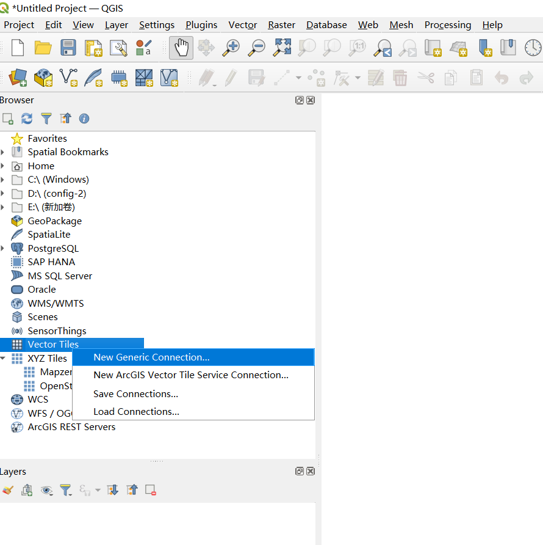
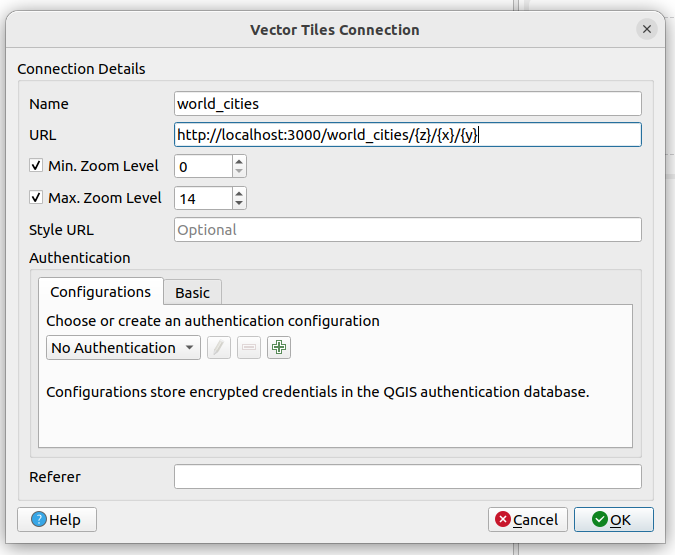
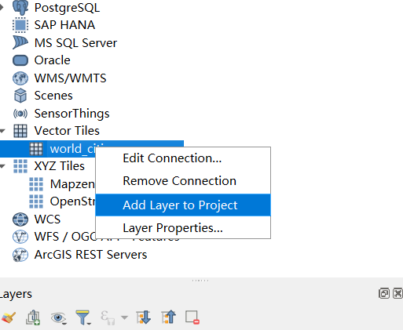
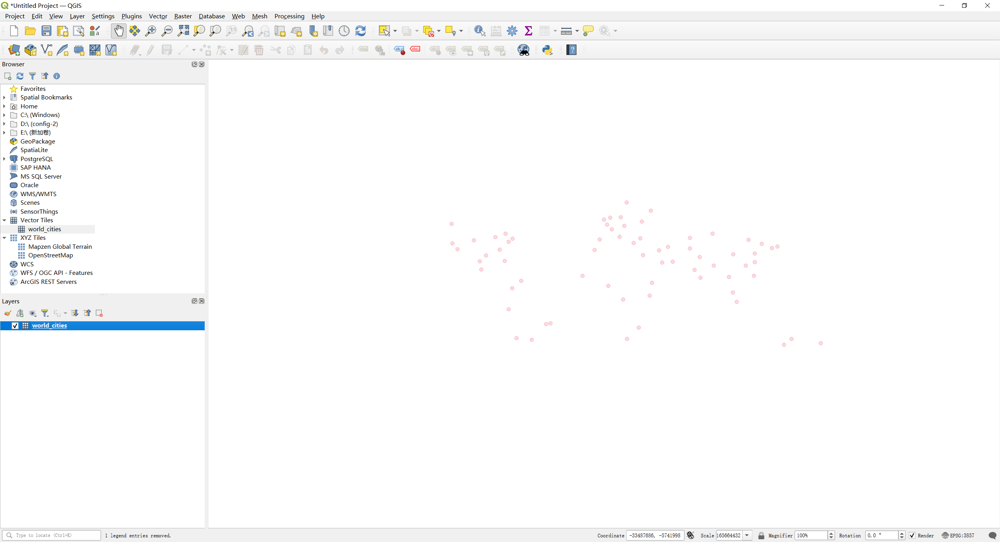

### View map with QGIS

1. Download, install, and run [QGIS](https://qgis.org/en/site/forusers/download.html) for your platform

2. Add a new `Vector Tiles` connection
   > 

3. In the `Vector Tile Connection` dialog, give it some name and the URL of the Martin server,
   e.g.  `http://localhost:3000/world_cities/{z}/{x}/{y}` and click `OK`.
   > 

4. In the QGIS browser panel (left), double-click the newly added connection, or right-click it and click
   on `Add Layer to Project`.
   > 

5. The map should now be visible in the QGIS map view.
   > 
