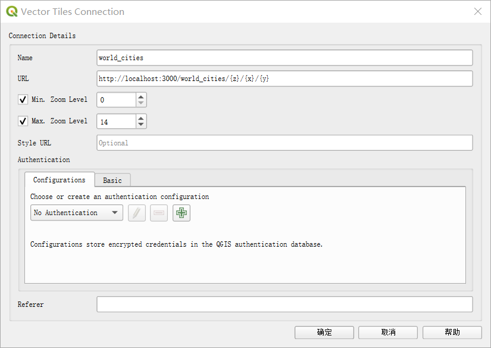

### View The Map

#### With QGIS

1. Open QGIS and add a new `Vector Tiles` with the following URL:`http://127.0.0.1:3000/world_cities`.

2. In the browser of QGIS, right click on the new added martin layer and click on `Add Layer to Project`, the map would be shown on the QGIS.

