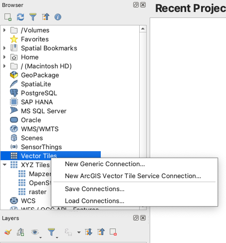
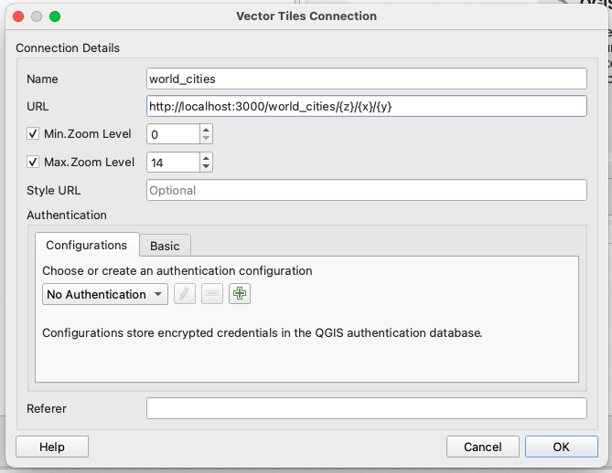
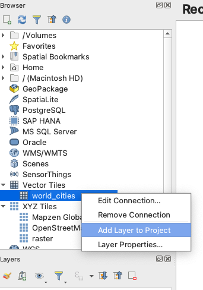
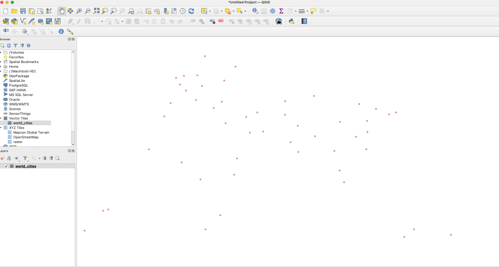

## With MacOS

### Download Martin And Data

1. Download the demo `world_cities.mbtiles
` , file from the [martin repo](https://github.com/maplibre/martin/blob/main/tests/fixtures/mbtiles/world_cities.mbtiles).

2. Download the latest version of Martin binary from the [release page](https://github.com/maplibre/martin/releases), for MacOS with Intel processors it's the `martin-x86_64-apple-darwin.tar.gz` file and for Apple silicon it's the `martin-aarch64-apple-darwin.tar.gz`. You could check the [About This Mac](https://support.apple.com/en-us/116943) to figure out the processors type.

3. Extract the file and place the `martin` and the `world_cities.mbtiles` in a same directory.

### Run Martin

1. Open the command prompt and navigate to the directory where `martin` and `world_cities.mbtiles` are located.

2. Run the following command to start Martin with the demo data:

```shell
martin --help
martin world_citie.mbtiles
```

### View The Map

1. Open QGIS and add a new `Vector Tiles` with the following URL:`http://127.0.0.1:3000/world_cities`.



2. In the browser of QGIS, right click on the new added martin layer and click on `Add Layer to Project`, the map would be shown on the QGIS.




